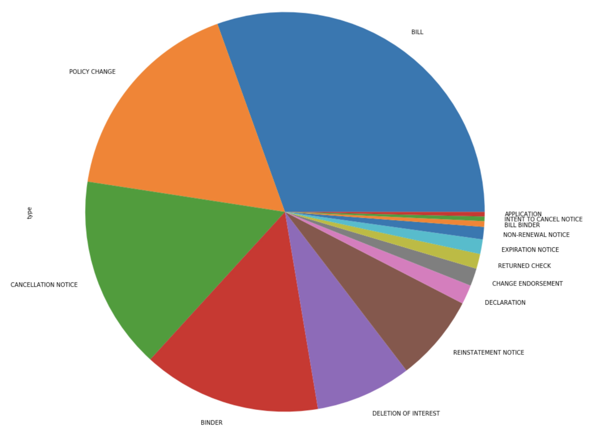

# HeavyWater Machine Learning Problem


### Problem Statement

Generally, the goal of this problem is to build a text classification model based on machine learning. Input is given as a csv file, which contains all documents that serve as our dataset to train and test our model. The document entry format is like this:

```
CANCELLATION NOTICE,641356219cbc f95d0bea231b ... [lots more words] ... 52102c70348d b32153b8b30c
```

So each document is composed of a label which indicates document type at its front, and a series of obscured OCR(Optical Character Recognition) data seperated by space and each of them maps to a unique word in original document.


### General Steps

Since the label is given, we will do supervised training on our dataset. Our main steps are:
1. Dataset Preparation - Load our dataset and perform basic pre-processing. E.g. figure our our dataset's composition and split dataset into train and test sets.
2. Feature Engineering - Transform raw dataset into flat features that can be used in our machine learning model.
3. Model Training - Train the model on labelled dataset.


### Step1: Dataset Preparation

Let's have a glance of our dataset first. There're 62204 documents in total and their distribution is shown below:


